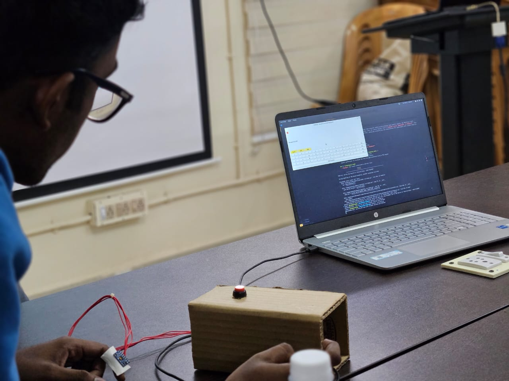
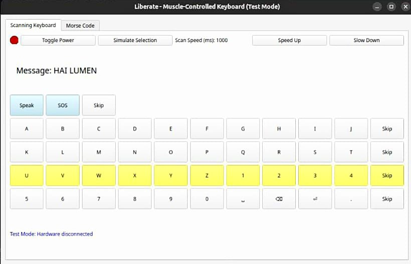
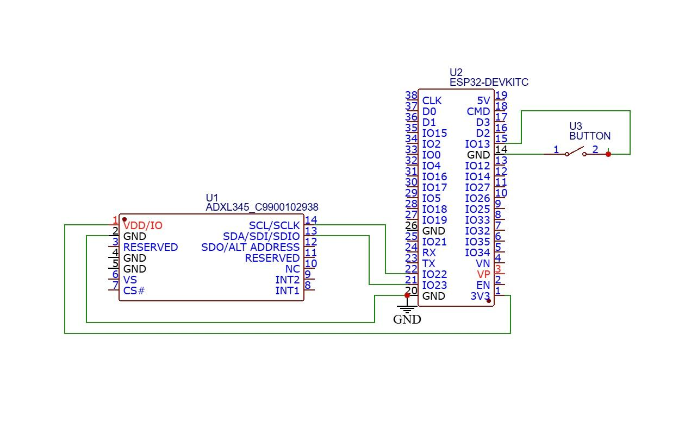

<p align="center">
  
</p>

# **Liberate : ATCS - Adaptive Typing & Control System**  
### *Freedom Beyond Barriers*  

[](https://github.com/aaromalonline/liberate)
[](https://www.linkedin.com/in/aaromalonline/)
[](https://github.com/aaromalonline/liberate)
<a href="https://github.com/aaromalonline/liberate/blob/master/LICENSE"></a>

**Liberate:ATCS** is a muscle-twitch-based control/communication system that translates subtle muscle movements into control signals through an adaptive typing interface. By detecting slight facial or body muscle activity, it enables users to operate devices such as a computer cursor, wheelchair, or keyboard. This innovative, hands-free solution enhances accessibility and communication for individuals with limited mobility, bridging the gap between physical limitations and digital interaction. Designed for real-time responsiveness and ease of use, Liberate: ATCS offers an intuitive and efficient alternative for assistive control.

**Our Vision :** Breaking barriers in digital accessibility by redefining how individuals with limited mobility communicate and control technology.

***[Visit liberate](https://www.liberate-atcs.vercel.app)***
***[See presentation (old)](https://www.canva.com/design/DAGgiwwJF50/0pNmzq6Z0drq8x91x3Nejg/view)***
***[Raw Media (BTS)](https://drive.google.com/drive/folders/16PRz2OhJrfej7ls2uXKP3qEmI2ENrzJ9?usp=sharing)***

𝒎𝒂𝒅𝒆 𝒘𝒊𝒕𝒉 ❤️ 𝑻𝒆𝒂𝒎 𝑳𝒖𝒎𝒆𝒏 :
[](https://www.linkedin.com/in/aaromalonline/) [](https://www.linkedin.com/in/deeraj-p-menon-aa4b5231b/)

𝒊𝒏𝒔𝒑𝒊𝒓𝒆𝒅 𝒃𝒚 [Intel's ACAT](https://www.intel.com/content/www/us/en/developer/tools/open/acat/overview.html) 


## 🛠️ Technologies Used
- **Python** for signal processing & control logic
- **ESP32** for sensor data acquisition via I2C and encoding of muscle twitches to control signals
- **ADXL345 Digital Accelerometer/Tap Sensor** for muscle movement detection (also IR reflexive sensor)

## 🚀 Features
- **Muscle twitch detector/encoder** using ADXL345 digital accelerometer & ESP32 to convert muscle twitches to control signals/clicks
- **Muscle controlled keyboard** with QWERTY & Morse mode available as a PyQt5 python desktop
- **Built-in SOS & speech synthesis** using a specch engine like gTTS
- **A minimal, cost-effective design** for real-world usability

### 👀 Comming soon
- Auto AI typing suggestions & Universal app interface 
- More control features like browse, advanced SOS messaging etc
- Mobility controls to move devices such as wheelchairs etc
- Multiple enhanced sensor integration for higher accuracy
- Minimization of hardware (via wireless communication with universal app interface)

## 💻 How it works? 
- **Sensor + Encoder** - When ON, The ADXL345 accelerometer records muscle twitches as 3-axis accelerations, which are encoded into clicks (0/1) using baseline calibration and filtering algorithms such as edge detection & debouncing filters.
- **Data Transmission** - Data is sent serially/wirelessly via ESP32 to the python application using I2C, where the user can control a keyboard interface using the decoded twitch clicks.
- **Adaptive Keyboard Interface in PyQt5** - Provides a moving highlight bar which spans across the rows of keyboard alternatively allowing the user to twitch to select a row and to select the key using the next twitch on circulating highlight.

## 📷 Project Images

<p align="center">
  
  
  
</p>

## 📥 Installation & Setup
1. Clone this repository:
   ```sh
   git clone https://github.com/your-username/Liberate.git
   cd Liberate
   ```
2. Install dependencies:
   ```sh
   pip install -r ./src/requirements.txt
   ```
3. Acquire/build hardware with the circuit diagram above and upload arduino code from ./interface/interface.ino to ESP32 & run main script by toggling the power switch ON
   (Note to toggle OFF the power button after usage to ensure smooth reading).
   ```sh
   python main.py
   ```

## 📜 License
Open-sourced under the MIT License for personal use. Contact us for commercial distribution <br>
See LICENSE file for details.

## 🤝 Support
Contributions are welcome! Feel free to submit issues or pull requests to improve the project.
⭐ support us by starring the repo ⭐

## 📬 Contact
For any queries or collaborations, reach out via **[aaromalonline@gmail.com]**.

---

> *"Breaking barriers, one motion at a time."*

