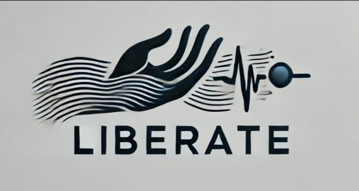

# 

# **Liberate**  
### *Freedom Beyond Barriers*  

**Liberate** is a muscle movement detection system that converts subtle muscle activity into control signals. By detecting slight facial or body muscle movements, the system enables users to control devices like a **computer cursor, wheelchair, or keyboard**. This innovation offers an intuitive, hands-free interface, enhancing accessibility and communication for individuals with limited mobility.

[Presentation](https://bit.ly/3XrDsM3)

## 🚀 Features
- Detects subtle muscle movements (facial/body)
- Converts movement signals into control actions
- Hands-free interaction for enhanced accessibility
- Can control a **computer cursor, wheelchair, or keyboard**
- Affordable and minimalistic design

### 👀 Modes of operation & Features of Ver1.0 (Comming soon..)
- Keyboard interface & control using muscle twitches
- specific command control having dedicated operations 
- Speech synthesizer to vocalize the text message generated using a TTS engine

## 🛠️ Technologies Used
- **Python** for signal processing & control logic
- **Arduino** for sensor data acquisition (I2C Interface)
- **Accelerometer/Tap Sensor** for muscle movement detection
- **Serial Communication** for real-time data transfer

## 📷 Project Image
(Add images or screenshots of your project here)

## 📥 Installation & Setup
1. Clone this repository:
   ```sh
   git clone https://github.com/your-username/Liberate.git
   cd Liberate
   ```
2. Install dependencies:
   ```sh
   pip install -r ./src/requirements.txt
   ```
3. Acquire hardware (comming soon), Upload arduino code to hardware & run main script
   ```sh
   python main.py
   ```

## 📜 License
This project is currently **proprietary**, but may be open-sourced in the future.

## 🤝 Contributing
Contributions are welcome! Feel free to submit issues or pull requests to improve the project.

## 📬 Contact
For any queries or collaborations, reach out via **[aaromalonline@gmail.com]**.

---

> *"Breaking barriers, one motion at a time."*

